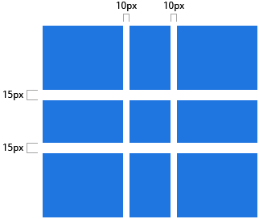
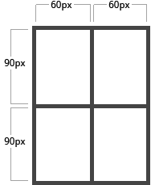
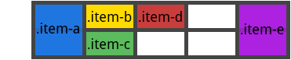

# Grid

> [A Complete Guide to Grid](https://css-tricks.com/snippets/css/complete-guide-grid/)

## 父容器

### display

将 element 设置为 grid 容器，并且为它的内容建立起 grid 格式上下文

*Values:*

- grid - 生成 block-level grid
- inline-grid - 生成 inline-level grid

```css
.container {
  display: grid | inline-grid;
}
```

### grid-template-columns  grid-template-rows

定义 grid 的列与行的空间的一组值。这个值代表网格大小,它们之间的空间代表了网格线。

*Values:*

- <track-size> - 可以是长度、百分比或网格中的空闲空间的一部分(使用fr单位)
- <line-name> - 网格线的名称


```css
.container {
  grid-template-columns: <track-size> ... | <line-name> <track-size> ...;
  grid-template-rows: <track-size> ... | <line-name> <track-size> ...;
}
```

*Examples:*

```css
.container {
  grid-template-columns: 40px 50px auto 50px 40px;
  grid-template-rows: 25% 100px auto;
}
```


可以选择设置明确的网格空间值，注意将值包裹在网格线中

```css
.container {
  grid-template-columns: [first] 40px [line2] 50px [line3] auto [col4-start] 50px [five] 40px [end];
  grid-template-rows: [row1-start] 25% [row1-end] 100px [third-line] auto [last-line];
}
```


一条线可以有两个名字，如第二行的网格线可以叫做： row1-end | row2-start

如果有一些重复的部分，可以使用`repeat()`

```css
.container {
  /* just like: 20px [col-start] 20px [col-start] 20px [col-start] 5%; */
  grid-template-columns: repeat(3, 20px [col-start]) 5%;
}
```

如果多条线使用同一个名称，可以引用名称和行数

```css
.item {
  grid-column-start: col-start 2;
}
```

fr 单位允许设置网格中的空闲空间的一部分。例如,这将每一项设置为一个各占三分之一网格容器的宽度

```css
.container {
  grid-template-columns: 1fr 1fr 1fr;
}
```

free space 在 non-flexible 项后计算。在这个例子中，适用 fr 单位的可用 free space 总量不包括 50px:

```css
.container {
  grid-template-columns: 1fr 50px 1fr 1fr;
}
```

### grid-template-areas

通过引用用网格区域属性指定的网格区域的名称来定义网格模板。重复网格区域的名称会导致内容跨越这些单元格。句点表示空单元格。语法本身提供了网格结构的可视化。

*Values:*

- <grid-area-name> - grid-area 名称
- . - 表示一个空白网格
- none - 没有定义网格

```css
.container {
  grid-template-areas: 
    "<grid-area-name> | . | none | ..."
    "...";
}
```

*Examples:*

```css
.item-a {
  grid-area: header;
}
.item-b {
  grid-area: main;
}
.item-c {
  grid-area: sidebar;
}
.item-d {
  grid-area: footer;
}

.container {
  grid-template-columns: 50px 50px 50px 50px;
  grid-template-rows: auto;
  grid-template-areas: 
    "header header header header"
    "main main . sidebar"
    "footer footer footer footer";
}
```

这将创建一个网格, 四列宽三行高。整个顶部行将由 header 区域组成。中间行将由两个 main 区域、一个空单元格和一个 sidebar 区域组成。最后一行是所有 footer。


声明中的每一行都需要具有相同数量的单元格。

可以使用任意数量的相邻句点声明单个空单元格。只要句点之间没有空格, 它们就代表单个单元格。

请注意你只是区域来命名区域。使用此语法时, 区域的任意一端的行实际上都自动命名。如果网格区域的名称为 foo, 则该区域的起始行行和起始列行的名称将为 foo-start, 其最后一行行和最后一列行的名称将是 foo-end, 例如上面示例中的最左行, 其中将有三个名称: header-start, main-start, 和 footer-start。

### grid-template

将 grid-template-rows, grid-template-columns, 和 grid-template-areas 在同一个声明中设置。

*Values:*

- none - 将三个属性设置为其初始值
- <grid-template-rows> / <grid-template-columns> - 分别将 grid-template-columns 和 grid-template-rows 设置为指定的值, 并将网格模板区域设置为 none

```css
.container {
  grid-template: none | <grid-template-rows> / <grid-template-columns>;
}
```

接受了一个更复杂但非常方便的语法, 用于指定所有三个属性：

*Examples:*

```css
/* 等于
.container {
  grid-template-rows: [row1-start] 25px [row1-end row2-start] 25px [row2-end];
  grid-template-columns: auto 50px auto;
  grid-template-areas: 
    "header header header" 
    "footer footer footer";
} */

.container {
  grid-template:
    [row1-start] "header header header" 25px [row1-end]
    [row2-start] "footer footer footer" 25px [row2-end]
    / auto 50px auto;
}
```

由于 grid-template 不重置隐式 grid 属性，如 grid-auto-columns, grid-auto-rows, 和 grid-auto-flow。所以推荐使用 grid 属性以替代 grid-template。

### grid-column-gap  grid-row-gap

指定网格线的大小。你可以把它想象成在列/行之间设置间隔的宽度。

*Values:*

- <line-size> - 一个长度值

```css
.container {
  grid-column-gap: <line-size>;
  grid-row-gap: <line-size>;
}
```
*Examples:*

```css
.container {
  grid-template-columns: 100px 50px 100px;
  grid-template-rows: 80px auto 80px;
  grid-column-gap: 10px;
  grid-row-gap: 15px;
}
```



gap 只在列/行之间创建, 而不是在外部边缘。

注意: 网格前缀将被删除, grid-column-gap 和 grid-row-gap 重命名为 column-gap 和 row-gap。无前缀属性已在 Chrome 68 +、Safari 11.2 版 50 + 和 Opera 54 + 中得到支持。

### grid-gap

grid-row-gap 和 grid-column-gap 的简写。

*Values:*

- <grid-row-gap> <grid-column-gap> - 长度值

```css
.container {
  grid-gap: <grid-row-gap> <grid-column-gap>;
}
```

*Example:*

```css
.container {
  grid-template-columns: 100px 50px 100px;
  grid-template-rows: 80px auto 80px;
  grid-gap: 15px 10px;
}
```

grid- 前缀与 grid-row-gap 类似，会在将来被删除。

### justify-items

沿 row 轴对齐，(与 column 轴排列的 align-items 相反)。此值适用于容器内的所有 grid 项。

*Values:*

start - 从单元格的起始边缘排列
end - 从单元格的结束边缘排列
center - 在单元格内居中
stretch - 充满单元格

```css
.container {
  justify-items: start;
}
```


```css
.container {
  justify-items: end;
}
```


```css
.container {
  justify-items: center;
}
```


```css
.container {
  justify-items: stretch;
}
```


### align-items

沿 column 轴对齐，(与 row 轴排列的 justify-items 相反)。

*Values:*

start - 从单元格的起始边缘排列
end - 从单元格的结束边缘排列
center - 在单元格内居中
stretch - 充满单元格

```css
.container {
  align-items: start;
}
```


```css
.container {
  align-items: end;
}
```


```css
.container {
  align-items: center;
}
```


```css
.container {
  align-items: stretch;
}
```


### justify-content

有时, 网格内容的大小可能小于其网格容器的大小。如果所有的网格项目都以非灵活的单位 (如 px) 大小进行调整, 则可能会发生这种情况。在这种情况下, 您可以在网格容器中设置网格的对齐方式。此属性沿 inline (row) 轴对齐网格 (与block (column) 轴 align-content 相反)。

*Values:*

start - 与 grid 容器的起始边缘对齐
end - 与 grid 容器的结尾边缘对齐
center - 在 grid 容器内居中
stretch - 重新设置宽度使充满 grid 容器
space-around - 在每个网格项之间间隔相同, 在两端有一半间隔大小
space-between - 在每个网格项之间间隔相同, 在两端没有空隙
space-evenly - 在每个网格项之间间隔相同, 在两端与中间间隔相同

```css
.container {
  justify-content: start;
}
```


```css
.container {
  justify-content: end;
}
```


```css
.container {
  justify-content: center;
}
```


```css
.container {
  justify-content: stretch;
}
```


```css
.container {
  justify-content: space-around;
}
```


```css
.container {
  justify-content: space-between;
}
```


```css
.container {
  justify-content: space-evenly;
}
```


### grid-auto-columns grid-auto-rows

指定任何自动生成的网格轨道 (又称为隐式网格轨道) 的大小。如果网格项多于栅格中的单元, 或者网格项放置在显式网格之外, 则会创建隐式曲目。(请参见[显式和隐式网格之间的区别](https://css-tricks.com/difference-explicit-implicit-grids/))。

*Values:*

- <track-size> - 可以为长度、百分比或fr单位

```css
.container {
  grid-auto-columns: <track-size> ...;
  grid-auto-rows: <track-size> ...;
}
```

要说明隐式网格轨道是如何创建的, 请参考以下内容:

```css
.container {
  grid-template-columns: 60px 60px;
  grid-template-rows: 90px 90px
}
```



这将创建一个 2 x 2 网格。

但是现在, 假设您使用`grid-column`和`grid-row`来定位 grid 项目, 如下:

```css
.item-a {
  grid-column: 1 / 2;
  grid-row: 2 / 3;
}
.item-b {
  grid-column: 5 / 6;
  grid-row: 2 / 3;
}
```


我们告诉 .item-b 从列5开始, 在列6行结束, 但我们从来没有定义列行5或6。因为我们引用了不存在的行, 所以创建了0宽度的隐式轨道来填充空白。我们可以使用`grid-auto-columns`和`grid-auto-rows`来指定这些隐式轨道的宽度:

```css
.container {
  grid-auto-columns: 60px;
}
```


### grid-auto-flow

如果 grid items 没有显式地放置在网格上, 自动放置算法自动放置项目。此属性用来控制自动放置算法的工作方式。

*Values:*

- row - 告诉自动放置算法依次填充每一行, 根据需要添加新行 (默认)
- column - 告诉自动放置算法依次填充每一列, 根据需要添加新列
- dense - 告诉自动放置算法, 如果稍后出现较小的项目, 则尝试在网格早期填充孔。

请注意, dense 只会更改项目的视觉顺序, 并可能导致它们出现不有序, 这对不利于可访问性。

*Example:*

```html
<section class="container">
  <div class="item-a">item-a</div>
  <div class="item-b">item-b</div>
  <div class="item-c">item-c</div>
  <div class="item-d">item-d</div>
  <div class="item-e">item-e</div>
</section>
```

```css
.container {
  display: grid;
  grid-template-columns: 60px 60px 60px 60px 60px;
  grid-template-rows: 30px 30px;
  grid-auto-flow: row;
}
```

将项目放置在网格上时, 只指定其中两个的点:

```css
.item-a {
  grid-column: 1;
  grid-row: 1 / 3;
}
.item-e {
  grid-column: 5;
  grid-row: 1 / 3;
}
```

因为我们设置了`grid-auto-flow`为`row`, 我们的网格将像这样。请注意, 我们没有放置的三个项目 (item-b、item-c 和item-d) 在可用行中流动:


如果我们设置`grid-auto-flow`为`column`：

```css
.container {
  display: grid;
  grid-template-columns: 60px 60px 60px 60px 60px;
  grid-template-rows: 30px 30px;
  grid-auto-flow: column;
}
```




## 子项目

### grid-column-start grid-column-end grid-row-start grid-row-end

通过引用特定的网格线来确定网格项内栅格项的位置。`grid-column-start`/`grid-row-start`是项目的开端, `grid-column-end`/`grid-row-end`是项目的结尾。

*Values:*

- <line> - 可以是一个数字指代网格线编号, 或一个名称指代网格线名称
- span <number> - 该项将跨越提供的网格轨道数
- span <name> - 该项目将跨越, 直到它遇到提供的名称的下一行
- auto - 指示自动放置、自动跨度或一个默认范围

```css
.item {
  grid-column-start: <number> | <name> | span <number> | span <name> | auto
  grid-column-end: <number> | <name> | span <number> | span <name> | auto
  grid-row-start: <number> | <name> | span <number> | span <name> | auto
  grid-row-end: <number> | <name> | span <number> | span <name> | auto
}
```

*Example:*

```css
.item-a {
  grid-column-start: 2;
  grid-column-end: five;
  grid-row-start: row1-start
  grid-row-end: 3
}
```


```css
.item-b {
  grid-column-start: 1;
  grid-column-end: span col4-start;
  grid-row-start: 2
  grid-row-end: span 2
}
```


如果未声明`grid-column-end`/`grid-row-end`, 则默认情况下该项将跨越1个轨道。

项目可以互相重叠。可以使用`z-index`来控制它们的堆叠顺序。

### grid-column grid-row

grid-column-start + grid-column-end 和 grid-row-start + grid-row-end 的简写。

*Values:*

- <start-line> / <end-line> - 每一个都接受与非简写版本相同的值, 包括跨度

*Example:*

```css
.item-c {
  grid-column: 3 / span 2;
  grid-row: third-line / 4;
}
```


如果未声明end line, 则默认情况下该项将跨越1轨道。

### grid-area

提供一个名称, 以便可以通过使用`grid-template-areas`创建的模板引用该项。或者, 此属性可用作`grid-row-start` + `grid-column-start` + `grid-row-end` + `grid-column-end`。

*Values:*

- <name> - 选择的名称
- <row-start> / <column-start> / <row-end> / <column-end> - 已编号或已命名的线

```css
.item {
  grid-area: <name> | <row-start> / <column-start> / <row-end> / <column-end>;
}
```

*Example:*

指定名称的方法

```css
.item-d {
  grid-area: header
}
```

对应简写 `grid-row-start` + `grid-column-start` + `grid-row-end` + `grid-column-end`:

```css
.item-d {
  grid-area: 1 / col4-start / last-line / 6
}
```


### justify-self 

沿内联 (row) 轴对齐单元格中的网格项 (与沿块 (column) 轴对齐相反)。此值适用于单个单元格内的网格项。

*Values:*

- start - 与其容器的起始边缘对齐
- end - 与其容器的起始边缘对齐
- center - 在容器内居中
- stretch - 充满容器 (默认值)

### align-self 

沿 column 轴对齐单元格中的网格项 (与沿 row 轴对齐相反)。此值适用于单个单元格内的网格项。

*Values:*

- start - 与其容器的起始边缘对齐
- end - 与其容器的起始边缘对齐
- center - 在容器内居中
- stretch - 充满容器 (默认值)

### place-self

`place-self`是`align-self`和`justify-self`的简写。

*Values:*

- auto - 默认布局方式
- <align-self> / <justify-self> - 同时设置`align-self`和`justify-self`。如果只设置一个值，则将该值同时赋予两个属性。