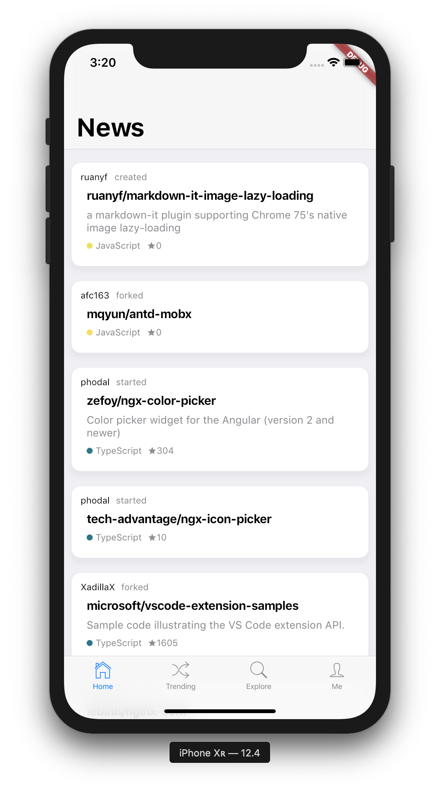

# 如何完成一个组件



分为2个组件：

- 具备圆角及阴影的卡片组件
- 展示标题、描述、语言类型、stars 数量的仓库组件

1. 使用组件

```dart
import 'package:fluhub/widgets/wrapper_card.dart';
import 'package:fluhub/widgets/repository_card.dart';
...
...
    WrapperCard(
      child: RepositoryCard(owner: repoOwner, name: repoName),
    )
...
```

2. 创建第一个组件

```dart
import 'package:flutter/cupertino.dart';

class WrapperCard extends StatelessWidget {
  final Widget child;

  WrapperCard({this.child}); // WrapperCard(child: xxx)
  // WrapperCard(this.child); // WrapperCard(xxx)

  @override
  Widget build(BuildContext context) {
    return Container(
      decoration: BoxDecoration(
        color: CupertinoColors.white,
        borderRadius: BorderRadius.all(Radius.circular(12.0)),
        boxShadow: [
          BoxShadow(
            color: CupertinoColors.lightBackgroundGray,
            blurRadius: 5.0,
            spreadRadius: 5.0,
            offset: Offset(0, 8.0),
          ),
        ],
      ),
      margin: EdgeInsets.all(16.0),
      padding: EdgeInsets.all(16.0),
      child: child, // this. 可以省略
    );
  }
}
```

3. 创建仓库信息组件

```dart
import 'package:flutter/material.dart';
import 'package:flutter/cupertino.dart';
import 'package:graphql_flutter/graphql_flutter.dart';

import '../utils/color.dart';

class RepositoryCard extends StatelessWidget {
  // github v4 查询仓库信息需要的参数 owner name
  final String owner;
  final String name;

  RepositoryCard({
    this.owner,
    this.name,
  }) {}

  @override
  Widget build(BuildContext context) {
    return Container(
      padding: EdgeInsets.all(8.0),
      child: DefaultTextStyle( // 设置内部默认的文字样式
        style: TextStyle(
          fontSize: 14.0,
          color: CupertinoColors.inactiveGray,
        ),
        child: Query( // graphql_flutter
          options: QueryOptions(
            document: queryRepo, // github v4 query
            variables: {
              'owner': this.owner,
              'name': this.name,
            },
          ),
          builder: (QueryResult result, {VoidCallback refetch}) { // 类似传给请求接口的 callback 根据 result 的状态返回对应的界面
            if (result.errors != null) {}
            if (result.loading) {
              return Center(child: CupertinoActivityIndicator());
            }

            final repo = result.data['repository'];
            return Column( // children 中的每个 child 占据一行，由上而下排列
              crossAxisAlignment: CrossAxisAlignment.start,
              children: <Widget>[
                Container( // repository 的标题
                  margin: EdgeInsets.only(bottom: 8.0),
                  child: Text(
                    '${this.owner}/${this.name}',
                    style: TextStyle(
                      fontSize: 16.0,
                      fontWeight: FontWeight.bold,
                      color: CupertinoColors.black,
                    ),
                  ),
                ),
                if (repo['description'] != null) // 如果有 repository 的描述
                  Container(
                    margin: EdgeInsets.only(bottom: 8.0),
                    child: Text(repo['description']),
                  ),
                DefaultTextStyle(
                  style: TextStyle(
                    fontSize: 12.0,
                    color: CupertinoColors.inactiveGray,
                  ),
                  child: Row(
                    children: <Widget>[
                      if (repo['primaryLanguage'] != null) // 如果有 repository 的主要语言
                        Row(
                          children: <Widget>[
                            SizedBox( // 带颜色的圆点
                              width: 8.0,
                              height: 8.0,
                              child: DecoratedBox(
                                decoration: BoxDecoration(
                                  borderRadius: BorderRadius.all(
                                    Radius.circular(8.0),
                                  ),
                                  color: HexColor(
                                      repo['primaryLanguage']['color']),
                                ),
                              ),
                            ),
                            Container(// primaryLanguage name 
                              margin: EdgeInsets.only(left: 4.0, right: 8.0),
                              child: Text(repo['primaryLanguage']['name']),
                            )
                          ],
                        ),
                      Icon( // star 五角星
                        Icons.star,
                        color: CupertinoColors.inactiveGray,
                        size: 12.0,
                      ), // star 数量
                      Text(repo['stargazers']['totalCount'].toString()),
                    ],
                  ),
                ),
              ],
            );
          },
        ),
      ),
    );
  }
}

final String queryRepo = '''
  query ReadRepositories(\$owner: String!, \$name: String!){
    repository(owner: \$owner, name: \$name) {
      primaryLanguage{
        color
        name
      }
      description
      stargazers{
        totalCount
      }
      updatedAt
    }
  }
''';

```