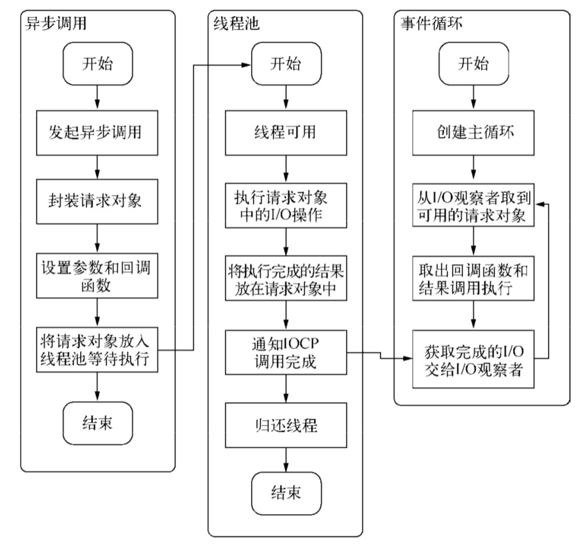

# 3.异步I/O

1. 为什么要异步I/O

   1. 用户体验

      请求资源的时间；数据分布到多台服务器上，分布式将成为常态。I/O是昂贵的，分布式I/O是更昂贵的。

   2. 资源分配

      完成互不相关任务的主流方法：

      - 单线程串行依次执行：会因阻塞I/O导致硬件资源得不到更优使用
      - 多线程并行完成：死锁、状态同步等问题

      Node：利用单线程，远离多线程死锁、状态同步等问题；利用异步I/O，让单线程远离阻塞。

      为了弥补单线程无法利用多核CPU的缺点，Node提供了类似Web Workers的子进程。

2. 异步I/O实现现状

   1. 异步I/O与非阻塞I/O

      操作系统将所有输入输出设备抽象为文件，阻塞I/O完成整个获取数据的过程，非阻塞I/O则不带数据直接返回，要获取数据，还需要通过文件描述符再次读取。

      为了获取完整的数据，应用程序需要重复调用I/O操作来确认是否完成。这种技术叫做轮询。

      - read。最原始、性能最低的一种，通过重复调用来检查I/O的状态来完成完整数据的读取。在得到最终数据前，CPU一直耗用在等待上。
      - select。通过文件描述符上的事件状态来判断。由于采用一个1024长度的数组来存储状态，最多可以同时检查1024个文件描述符。
      - poll。采用链表的方式避免数组长度的限制，能避免不必要的检查。文件描述符较多的时候，性能十分低下。
      - epoll。该方案事Linux下效率最高的I/O事件通知机制。在进入轮询的时候如果没有检查到I/O事件，将会进行休眠，直到事件将它唤醒。它真实利用了事件通知、执行回调的方式，而不是遍历查询。

   2. 理想的非阻塞异步I/O

      应用程序发起非阻塞调用，无需通过遍历或者事件唤醒等方式轮询，可以直接处理下一个任务，只需在I/O完成后通过信号或回调将数据传递给应用程序。

   3. 现实的异步I/O

      让部分线程进行阻塞I/O或者非阻塞I/O加轮询技术来完成数据获取，让一个线程进行计算处理，通过线程之间的通信将I/O得到的数据进行传递。

      Windows下IOCP的异步I/O模型。

      Node的单线程仅仅只是JavaScript执行在单线程中。无论在*nix还是Windows平台，内部完成I/O任务的另有线程池。

3. Node的异步I/O

   1. 事件循环

      Node自身的执行模型——事件循环。

      启动进程时，Node便会创建一个类似于`while(true)`的循环，每执行一次循环体的过程我们称为Tick。每个Tick的过程就是查看是否有事件待处理。

   2. 观察者

      Tick的过程中，由观察者判断是否有事件需要处理。每个事件循环中有一个或者多个观察者，而判断是否有事件要处理的过程就是想这些观察者询问是否有要处理的事件。

   3. 请求对象

      从JavaScript发起调用到内核执行完I/O操作的过渡过程中，存在一种中间产物，它叫做请求对象。请求对象是异步I/O过程中的重要中间产物，所有的状态都保存在这个对象中，包括送入线程池等待执行以及I/O操作完毕后的回调处理。

   4. 执行回调

      组装好请求对象、送入I/O线程池等待执行，实际上完成了异步I/O的第一部分，回调通知是第二部分。I/O观察者回调函数的行为就是取出请求对象的result属性作为参数，取出oncomplete_sym属性作为方法，然后调用执行，以此达到调用JavaScript中传入的回调函数的目的。

      

   5. 小结

      在Node中，除了JavaScript是单线程外，Node自身是多线程的，只是I/O线程使用的CPU较少。除了用户代码无法并行执行外，所有的I/O则是可以并行起来的。

4. 非I/O的异步API

   1. 定时器

      setTimeout()和setInterval()的问题在于，它并非精确的，如果某一次循环占用的时间较多，那么下次循环时，它也许已经超时很久了。

   2. process.nextTick()

      setTimeout(fn, 0)的方式较为浪费性能。process.nextTick()方法的操作相对较为轻量。

   3. setImmediate()

      process.nextTick()中的回调函数执行的优先级要高于setImmediate()。process.nextTIck()属于idle观察者，setImmediate()属于check观察者。在具体实现上，process.nextTick()的回调函数保存在一个数组中，setImmediate()的结果则是保存在链表中。在行为上，process.nextTick()在每轮循环中会将数组中的回调函数全部执行完，而setImmediate()在每轮循环中执行链表中的一个回调函数。

5. 事件驱动与高性能服务器

   几种经典的服务器模型：

   - 同步式。一次只能处理一个请求，并且其余请求都处于等待状态。
   - 每进程／每请求。为每个请求启动一个进程，这样可以处理多个请求，但它不具备扩展性，因为系统资源只有这么多。
   - 每线程／每请求。为每个请求启动一个线程来处理。由于每个线程都占用一定内存，当大并发请求到来时，内存将会很快用光。
