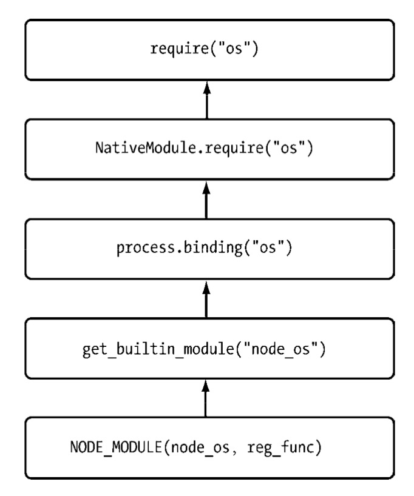
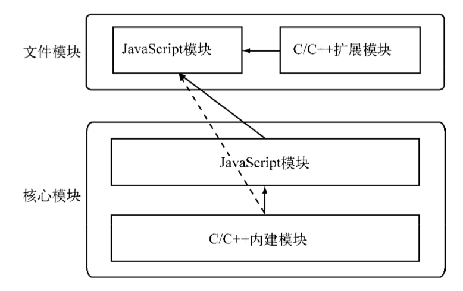

# 02.模块机制

## CommonJS 规范

1. 出发点

   JavaScript 规范的缺陷：

   1. 没有模块系统
   2. 标准库较少
   3. 没有标准接口
   4. 缺乏包管理系统：导致 JavaScript 应用中基本没有自动加载和安装依赖的能力。

   CommonJS 规范的提出，不仅为了可以利用 JavaScript 开发富客户端应用，而且可以编写以下应用

   - 服务器端 JavaScript 应用程序
   - 命令行工具
   - 桌面图形界面应用程序
   - 混合应用

2. 模块规范

   1. 模块引用

      `var math = require('math')`

   2. 模块定义

      上下文提供了 exports 对象用于导出当前模块的方法或者变量，并且它是唯一导出的出口。

      在模块中，还存在一个 module 对象，它代表模块自身，而 exports 是 module 的属性。在 Node 中，一个文件就是一个模块，将方法挂载在 exports 对象上作为属性即可定义导出的方式。

      ```javascript
      // math.js
      exports.add = function () { ... }

      // other.js
      var math = require('math')
      math.add(...)
      ```

   3. 模块标识

      模块标识其实就是传递给`require()`方法的参数

## Node 的模块实现

在 Node 中引入模块，需要经历如下 3 个步骤

1. 路径分析
2. 文件定位
3. 编译执行

在 Node 中，模块分为两类：

1. Node 提供的模块，称为核心模块；

   核心模块部分在 Node 源代码的编译过程中，编译进了二进制执行文件。在 Node 进程启动时，部分核心模块被直接加载进内存中，引入这部分核心模块时，文件定位和编译执行这两个步骤可以省略掉，并在路径分析中优先判断。

2. 用户编写的模块，称为文件模块。

   文件模块则是在运行时动态加载，需要完整的路径分析、文件定位、编译执行过程

详细的模块加载过程：

1. 优先从缓存中加载

   Node 缓存的是编译和执行之后的对象。

   `require()`方法对相同模块的二次加载都一律采用缓存优先的方式，这是第一优先级的。不同之处在于核心模块的缓存检查先于文件模块的缓存检查。

2. 路径分析和文件定位

   对于不同的标识符，模块的查找和定位有不同程度上的差异。

   1. 模块标识符分析

      - 核心模块，如`http`、`fs`、`path`；

        核心模块的优先级仅次于缓存加载。文件模块的标识符需要与核心模块的不同，或换用路径的方式。

      - `.`或`..`开始的相对路径文件模块；
      - 以`/`开始的绝对路径文件模块；

        都视为文件模块。`require()`方法会将路径转为真实路径，并以真实路径作为索引，将编译执行后的结果放到缓存中，以使二次加载时更快。

      - 非路径形式的文件模块，如自定义的`connect`模块；

        生成规则沿路径向上逐级递归，直到根目录下的`node_modules`目录

   2. 文件定位

      - 文件扩展名分析

        Node 会按 .js、.json、.node 的次序补足扩展名。在尝试的过程中，需要调用`fs`模块同步阻塞式地判断文件是否存在。带上文件扩展名会更利于速度的提升。

      - 目录分析和包

        可能没有查找到相应文件，但却得到一个目录，这在引入自定义模块和逐个模块路径进行查找时经常出现，此时 Node 会将目录当做一个包来处理。

        首先 Node 在当前目录下查找 package.json (CommonJS 包规范定义的包描述文件)，通过`JSON.parse()`解析出包描述对象，从中取出`main`属性指定的文件名进行定位。

        如果`main`属性指定的文件名错误，或者压根没有`package.json`，Node 会将`index`当作默认文件名。如果在目录分析的过程中没有定位成功任何文件，则自定义模块进入下一个模块路径进行查找。如果没有查找到目标文件，则会抛出查找失败的异常。

   3. 模块编译

      - .js 文件。通过`fs`模块同步读取文件后编译执行。
      - .node 文件。这是用 C/C++编写的扩展文件，通过`dlopen()`方法加载最后编译生成的文件。
      - .json 文件。通过`fs`模块同步读取文件后，用`JSON.parse()`解析返回结果。
      - 其余扩展名文件。它们都被当作.js 文件载入。

      每一个编译成功的模块都会将其文件路径作为索引换存在`Module._cache`对象上。在确定文件的扩展名之后，Node 将调用具体的编译方式来将文件执行后返回给调用者。

      1. JavaScript 模块的编译

         在编译过程中，Node 对获取的 JavaScript 文件内容进行了头尾包装。在头部添加了`(function (exports, require, module, __filename, __dirname) {\n`，在尾部添加了`\n});`：

         ```javascript
         (function(exports, require, module, __filename, __dirname) {
           var math = require("math");
           exports.area = function(radius) {
             return Math.PI * radius * radius;
           };
         });
         ```

         这样每个模块文件都进行了作用域隔离。在执行之后，模块的 exports 属性被返回给了调用方。

         在存在 exports 的情况下，还存在 module.exports 的原因是，exports 对象是通过形参的方式传入的，直接赋值形参会改变形参的引用，但并不能改变作用于外的值。如果要达到`require`引入一个类的效果，请赋值给`module.exports`对象。

      2. C/C++模块的编译

         Node 调用`process.dlopen()`方法进行加载和执行。

      3. JSON 文件的编译

         Node 利用`fs`模块同步读取 JSON 文件的内容之后，调用`JSON.parse()`得到对象，然后将它赋给模块对象的`exports`。如果定义了一个 JSON 文件作为配置，直接调用`require()`引入即可。

3. 核心模块

   1. JavaScript 核心模块的编译过程

      1. 转存为 C/C++ 代码

         Node 将所有内置的 JavaScript 代码(src/node.js 和 ֖lib/\*.js)转换成 C++ 里的数组，生成`node_natives.h`头文件。这个过程中，JavaScript 代码以字符串的形式存储在 node 命名空间中，不可直接执行。启动 Node 进程时，JavaScript 代码直接加载进内存中。

      2. 编译 JavaScript 核心模块

         同样需要经过头尾包装的过程，lib 目录下的所有模块与文件模块有区别的地方在于：获取源代码的方式（核心模块是从内存中加载的）以及缓存执行结果的位置。核心模块缓存到`NativeModule._cache`对象上。

   2. C/C++ 核心模块的编译过程

      将由纯 C/C++ 编写的部分统一称为内建模块。

      1. 内建模块的组织形式

         每一个内建模块在定义之后，都通过`NODE_MODULE`宏将模块定义到 node 命名空间中，模块的具体初始化方法挂载为结构的`register_func`成员。`node_extension.h`文件将这些散列的内建模块统一放进了一个叫`node_module_list`的数组中。

         Node 提供了`get_builtin_module()`方法从`node_module_list`数组中取出这些模块。

         内建模块的优势在于：性能上优于脚本语言。在文件编译时，它们被编译进二进制文件。一旦 Node 开始执行，它们被直接加载进内存中，无需再次做标识符定位、文件定位、编译等过程，直接可以执行。

      2. 内建模块的导出

         文件模块可能会调用核心模块。Node 在启动时，会生成一个全局变量`process`，并提供`Binding()`方法来协助加载内建模块。

         在加载内建模块时，先创建一个`exports`空对象，然后调用`get_builtin_module()`方法取出内建模块对象，通过执行`register_func()`填充 exports 对象，最后将 exports 对象按模块名缓存，并返回给调用方完成导出。

      3. 核心模块的引入流程

         

      4. 编写核心模块

4. C/C++扩展模块

   略。`node-gyp`工具。

5. 模块调用栈

   

6. 包与 NPM

   包规范定义，由包结构和包描述文件两个部分组成，前者用于组织包中的各种文件，后者则用于描述包的相关信息。

   1. 包结构

      - package.json：包描述文件；
      - bin：用于存放可执行二进制的目录；
      - lib：用于存放 JavaScript 代码的目录；
      - doc：用于存放文档的目录；
      - test：用于存放单元测试用例的代码

   2. 包描述文件与 NPM

      包描述文件用于表达非代码相关的信息——package.json。NPM 是基于规范的实现。

   3. NPM 常用功能

   4. 局域 NPM

   5. NPM 潜在问题

      包质量和安全问题

7. 前后端共用模块

   1. 模块的侧重点

      浏览器端的 JavaScript 需要经历从同一个服务器端分发到多个客户端执行，瓶颈在于带宽。服务器端 JavaScript 需要经历同一个服务器分发到多个客户端执行，瓶颈在于 CPU 和内存等资源。

   2. AMD 规范

      AMD 规范是 CommonJS 模块规范的一个延伸，定义为

      `define(id?, dependencies?, factory);`

      AMD 需要用`define`来定义一个模块，并且内容需要通过`return`的方式实现导出。

      ```javascript
      define(["dep1", "dep2"], function() {
        var exports = {};
        exports.sayHello = function() {
          alert("Hello from module: " + module.id);
        };
        return exports;
      });
      ```

   3. CMD 规范

      ```javascript
      define(function(require, exports, module) {
        // The module code goes here
      });
      ```

   4. 兼容多种模块规范

      ```Javascript
      ;(function (name, definition) {
         // 检测上下文环境是否为AMD或CMD
         var hasDefine = typeof define === 'function'
         // 检查上下文环境是否为Node
         var hasExports = typeof module !== 'undefined' && module.exports;

         if (hasDefine) { // AMD环境或CMD环境
            define(definition);
         } else if (hasExports) { // 定义为普通Node模块
            module.exports = definition();
         } else { // 将模块的执行结果挂在window变量中，在浏览器中this指向window对象
            this[name] = definition(); }
      })('hello', function () {
         var hello = function () {};
         return hello;
      });
      ```

      ​

8. 总结

   Node 通过模块规范，组织了自身的原生模块，弥补了 JavaScript 弱结构性的问题，形成了稳定的结构，并向外提供服务。NPM 通过对包规范的  支持，有效的阻止了第三方模块。CommonJS 规范帮助 Node 形成了它的骨骼。
