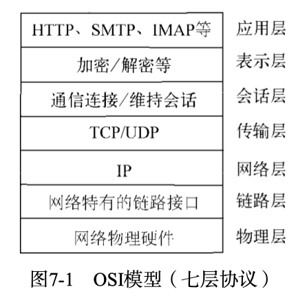
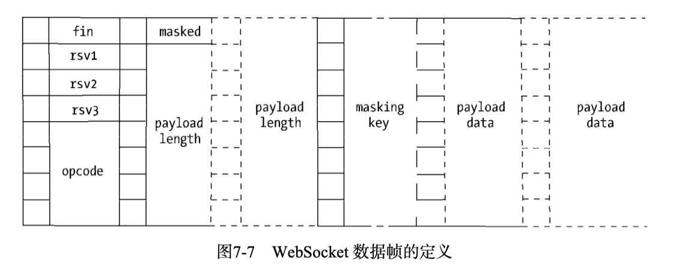

# 7.网络编程

Node 是一个面向网络而生的平台，它具有事件驱动、无阻塞、单线程等特性。Node 提供了`net`、`dgram`、`http`、`https`这 4 个模块，分别用于处理 TCP、UDP、HTTP、HTTPS，适用于服务器端和客户端。

1. 构建 TCP 服务

   1. TCP

      TCP 全名为传输控制协议，在 OSI 模型（由七层组成，分别为物理层、数据链结层、网络层、传输层、会话层、表示层、应用层）中属于传输层协议。许多应用层协议基于 TCP 构建，典型的是 HTTP、SMTP、IMAP 等协议。

      

      TCP 是面向连接的协议，其显著的特征是在传输之前需要 3 次握手形成会话。客户端请求连接(第一次)，服务器端响应(第二次)，客户端开始传输(第三次)。

   2. 创建 TCP 服务器端

      `net.createServer(listener)`

      ```javascript
      var net = require("net");

      var server = net.createServer(function(socket) {
        // 新的连接
        socket.on("data", function(data) {
          socket.write("hellow");
        });

        socket.on("end", function() {
          console.log("disconnect");
        });
        socket.write("welcome to the Node.js.\n");
      });

      server.listen(8124, function() {
        console.log("server bound");
      });
      ```

   3. TCP 服务的事件

      代码分为服务器事件和连接事件。

      1. 服务器事件

         通过`net.createServer()`创建的服务器而言，它是一个 EventEmitter 实例，它的自定义事件有如下几种：

         - listening：在调用`server.listen()`绑定端口或者 Domain Socket 后触发。
         - connection：每个客户端套接字连接到服务器端时触发，简洁写法为通过`net.createServer()`，最后一个参数传递。
         - close：当服务器关闭时触发，在调用`server.close()`后，服务器将停止接受新的套接字连接，但保持当前存在的连接，等待所有链接都断开后，会触发该事件。
         - error：当服务器发生异常时，将会触发该事件。

      2. 连接事件

         服务器可以同时与多个客户端保持连接，对于每个连接而言是典型的可写可读 Stream 对象。Stream 对象可以用于服务器端和客户端之间的通信。它具有如下自定义事件：

         - data：当一端调用`write()`发送数据时，另一端会触发`data`事件，事件传递的数据即是`write()`发送的数据。
         - end：当连接中的任意一端发送了 FIN 数据时，将会触发该事件。
         - connect：该事件用于客户端，当套接字与服务器端连接成功时会被触发。
         - drain：当任意一端调用`write()`发送数据时，当前这端会触发该事件。
         - error：当异常发生时，触发该事件。
         - close：当套接字完全关闭时，触发该事件。
         - timeout：当一定时间后连接不在活跃时，该事件将会被触发，通知用户当前该连接已经被闲置了。

           由于 TCP 套接字是可写可读的 Stream 对象，可以利用`pipe()`方法巧妙地实现管道操作。

           TCP 针对网络中的小数据包有一定的优化策略：Nagle 算法。

           如果每次只发送一个字节的内容而不优化，网络中将充满只有极少数有效数据的数据包，将十分浪费网络资源。Nagle 算法要求缓冲区的数据达到一定数量或者一定时间后才将其发出，所以小数据包将会被 Nagle 算法合并。

           可以调用`socket.setNoDelay(true)`去掉 Nagle 算法，使数据不会被延迟发送。在关闭 Nagle 算法后，另一端可能会将接收到的多个小数据包合并，然后只触发一次 data 事件。

2. 构建 UDP 服务

   UDP 又称用户数据包协议，与 TCP 一样同属于网络传输层。TCP 中连接一旦建立，所有的会话都基于连接完成，客户端如果要与另一个 TCP 服务通信，需要另创建一个套接字来完成连接。但在 UDP 中，一个套接字可以与多个 UDP 服务通信，它虽然提供面向事务的简单不可靠信息传输服务，在网络差的情况下存在丢包严重的问题，但由于它无需连接，资源消耗低，处理快速且灵活，所以常常应用在偶尔丢一两个数据包也不会产生重大影响的场景。

   1. 创建 UDP 套接字

      UDP 套接字一旦创建，既可以作为客户端发送数据，也可以作为服务器端接收数据。

      ```javascript
      var dgram = require("dgram");
      var socket = dgram.createSocket("udp4");
      ```

   2. 创建 UDP 服务器端

      若想让 UDP 套接字接收网络消息，只要调用`dgram.bind(port, [address])`方法对网卡和端口进行绑定即可。

      ```javascript
      var dgram = require("dgram");

      var server = dgram.createSocket("udp4");

      server.on("message", (msg, rinfo) => {
        console.log(`server got: ${msg} from ${rinfo.address}: ${rinfo.port}`);
      });

      server.on("listening", () => {
        var address = server.address();
        console.log(`server listening ${address.address}:${address.port}`);
      });

      server.bind(41234);
      ```

      该套接字将接受所有网卡上 41234 端口上的消息。在绑定完成后，将出发 listening 事件。

   3. 创建 UDP 客户端

      ```javascript
      var dgram = require("dgram");

      var message = new Buffer("Node.js");
      var client = dgram.createSocket("udp4");
      client.send(message, 0, message.length, 41234, "localhost", function(
        err,
        bytes
      ) {
        client.close();
      });
      ```

      执行后，服务器端将输出

      ```bash
      server listening 0.0.0.0:41234
      server got: Node.js from 127.0.0.1:58682
      ```

      客户端可以通过`send()`方法发送消息：`socket.send(buf, offset, length, port, address, [callback])`

   4. UDP 套接字事件

      UDP 套接字是 EventEmitter 的实例

      - message：当 UDP 套接字侦听网卡端口后，接收到消息时触发该事件，触发携带的数据为消息 Buffer 对象和一个远程地址信息。
      - listening：当 UDP 套接字开始侦听时触发该事件。
      - close：调用`close()`方法时触发该事件，并不再触发`message`事件。如需再次触发`message`事件，重新绑定即可。
      - error：当异常发生时触发该事件，如果不侦听，异常将直接抛出，使进程推出。

3. 构建 HTTP 服务

   1. HTTP

      1. 初识 HTTP

         HTTP 全称是超文本传输协议（HyperText Transfer Protocol），HTTP 构建在 TCP 之上，属于应用层协议。在 HTTP 的两端是服务器和浏览器，即著名的 B/S 模式。

      2. HTTP 报文

         在启动上述服务器端代码后，我们对经典示例代码进行一次报文的获取。

         网络通信的报文信息分为几个部分：第一部分内容为经典的 TCP 的 3 次握手过程；第二部分是在完成握手之后，客户端向服务器端发送请求报文；第三部分是服务器端完成处理后，向客户端发送响应内容，包括响应头和响应体；最后部分是结束会话的信息。

         从上述的报文信息中可以看出 HTTP 的特点，它是基于请求响应式的。HTTP 服务只做两件事情：处理 HTTP 请求和发送 HTTP 响应。报文内容都包括两个部分：报文头和报文体。

   2. http 模块

      在 Node 中，HTTP 服务继承自 TCP 服务器（net 模块），它能够与多个客户端保持连接，由于其采用事件驱动的形式，并不为每一个连接创建额外的线程或进程，保持很低的内存占用，所以能实现高并发。HTTP 服务与 TCP 服务模型的区别是，在开启`keepalive`后，一个 TCP 会话可以用于多次请求和响应。TCP 服务以 connection 为单位进行服务，HTTP 服务以 request 为单位进行服务。http 模块即是将 connection 到 request 的过程进行了封装。

      1. HTTP 请求

         对于 TCP 连接的读操作，http 模块将其封装为 ServerRequest 对象。

      2. HTTP 响应

         `res.setHeader()`和`res.writeHead()`，报头在报文体发送前发送的。可以调用`setHeader`进行多次设置，但只有调用`writeHead`后，报头才会写入到连接中。无论服务器端在处理业务逻辑时是否发生异常，务必在结束时调用`res.end()`结束请求。

      3. HTTP 服务的事件

         服务器也是一个 EventEmitter 实例

         - connection 事件：在开始 HTTP 请求和响应前，客户端与服务端需要建立底层的 TCP 连接，这个链接可能因为开启了`keep-alive`，可以在多次请求响应之间使用；当这个连接建立时，服务器触发一次 connection 事件。
         - request 事件：建立 TCP 连接后，当请求数据发送到服务器端，在解析出 HTTP 请求头后，将会触发该事件；在`res.end()`后，TCP 连接可能将用于下一次请求响应。
         - close 事件：与 TCP 服务器的行为一致，调用`server.close()`方法停止接受新的连接，当已有的连接都断开时，触发该事件；可以给`server.close()`传递一个回调函数来快速注册该事件。
         - checkContinue 事件：某些客户端在发送较大的数据时，并不会将数据直接发送，而是先发送一个头部带`Expect: 100-continue`的请求到服务器，服务器将会触发 checkContinue 事件。该事件发生时不会触发`request`事件，当客户端收到`100 Continue`后重新发起请求时，才会触发。
         - connect 事件：当客户端发起 CONNECT 请求时触发，而发起 CONNECT 请求通常在 HTTP 代理时出现；如果不监听该事件，发起该请求的连接将会关闭。
         - upgrade 事件：当客户端要求升级连接的协议时，需要和服务器端协商，客户端会在请求头中带上`Upgrade`字段，服务器端会在接收到这样的请求时触发该事件。如果不监听该事件，发起该请求的连接将会关闭。
         - clientError 事件：连接的客户端触发 error 事件时，这个错误会传递到服务器端，此时触发该事件。

   3. HTTP 客户端

      1. HTTP 响应

         ClientRequest 在解析响应报文时，一解析完响应头就出发 response 事件，同时传递一个响应对象以供操作 ClientResponse，后续响应报文体以只读流的方式提供

      2. HTTP 代理

         http 提供的 ClientRequest 对象也是基于 TCP 层实现的，在 keepalive 的情况下，一个底层会话连接可以多次用于请求。默认情况下，通过 ClientRequest 对象对同一个服务器端发起的 HTTP 请求最多可以创建 5 个连接。实质是一个连接池。

         调用 HTTP 客户端同时对一个服务器发起 10 次 HTTP 请求时，其实只有 5 个请求出于并发状态，后续的请求需要等待某个请求完成服务后才真正发出。可以设置 agent 选项为 false 值，以脱离连接池的管理，使得请求不受并发的限制。

         Agent 对象的 sockets 和 requests 的属性分别表示当前连接池中使用中的连接数和处于等待状态的请求数。

      3. HTTP 客户端事件

         - response：与服务器端的 request 事件对应的客户端在请求发出后得到服务器端响应时，会触发该事件。
         - socket：当底层连接池中建立的连接分配给当前请求对象时，触发该事件。
         - connect：当客户端向服务器端发起 CONNECT 请求时，如果服务器端响应了 200 状态码，客户端将会触发该事件。
         - upgrade：客户端向服务器端发起 Upgrade 请求时，如果服务器端响应了`101 Switching Protocols`状态，客户端将会触发该事件。
         - continue：客户端向服务器端发起`Expect: 100-continue`头信息，以试图发送较大数据量，如果服务器端响应`100 Continue`状态，客户端将触发该事件。

      4. 构建 WebSocket 服务

         WebSocket 客户端基于事件的编程模型与 Node 中自定义事件相差无几。WebSocket 实现了客户端与服务器端之间的长连接，而 Node 事件驱动的方式十分擅长与大量的客户端保持高并发连接。

         好处：

         - 客户端与服务器端只建立一个 TCP 连接，可以使用更少的连接。
         - WebSocket 服务器端可以推送数据到客户端，这远比 HTTP 请求响应模式更灵活、更高效。
         - 有更轻量级的协议头，减少数据传送量。

         在 WebSocket 之前，网页客户端与服务器端进行通信最高效的是 Comet 技术。实现 Comet 技术的细节是采用长轮询或 iframe 流。长轮询的原理是客户端向服务端发起请求。使用 WebSocket 的话，客户端只需一个 TCP 连接即可完成双向通信，无需频繁断开连接和重发请求。

         WebSocket 协议主要分为两个部分：握手和数据传输。

         1. WebSocket 握手

            通过 HTTP 发起请求报文，与普通的 HTTP 请求协议的区别在于这些协议头：

            ```
            Upgrade: websocket
            Connection: Upgrade
            ```

            上述两个字段表示请求服务器端升级协议为 WebSocket。`Sec-WebSocket-Key`用于安全校验，`Sec-WebSocket-Protocol`指定子协议，`Sec-WebSocket-Version`制定版本号。

            一旦 WebSocket 握手成功，服务器端与客户端将会呈现对等的效果，都能接收和发送消息。

         2. WebSocket 数据传输

            在握手顺利完成后，当前连接将不再进行 HTTP 的交互，而是开始 WebSocket 的数据帧协议，实现客户端与服务器端的数据交换。

            握手完成时，客户端的`onopen()`将会被触发执行。当客户端调用`send()`发送数据时，服务器端触发`onmessage()`；当服务器端调用`send()`发送数据时，客户端的`onmessage()`触发。

            为了安全考虑，客户端需要对发送的数据帧进行掩码处理，服务器一旦受到无掩码帧，连接将关闭。而服务器发送到客户端的数据帧则无须做掩码处理，如果客户端收到带掩码的数据帧，连接将关闭。

            WebSocket 数据帧的定义，每 8 位为一列，也即 1 个字节。

            

            - fin
            - rsv1、rsv2、rsv3
            - opcode
            - masked
            - payload length
            - masking key
            - payload data

      5. 网络服务与安全

         SSL（安全套接层），TLS（安全传输层协议）

         1. TLS/SSL

            1. 密钥

               TLS/SSL 是一个公钥/私钥的结构，它是一个非对称的结构，每个服务器端和客户端都有自己的公私钥。公钥用来加密要传输的数据，私钥用来解密接收到的数据。公钥和私钥是配对的，通过公钥加密的数据，只有通过私钥才能揭秘，所以在建立安全传输之前，客户端和服务器端之间需要互换公钥。

               Node 在底层采用的是 openssl 实现 TLS/SSL。

               数据传输的过程中还需要对得到的公钥进行认证，以确认得到的公钥是出自目标服务器。

            2. 数字证书

               CA 的作用是为站点颁发证书，且这个证书中具有 CA 通过自己的公钥和私钥实现的签名。为了得到签名证书，服务器端需要通过自己的私钥生成 CSR（证书签名请求）文件。CA 机构将通过这个文件颁发属于该服务端的签名证书，只要通过 CA 机构就能验证证书是否合法。

               服务端需要向 CA 机构申请签名证书。在申请签名证书之前依然要创建自己的 CSR 文件。

         2. TLS 服务

            1. 创建服务器端

               在需要的证书都备齐之后，通过 Node 的 tls 模块来创建一个安全的 TCP 服务。

            2. TLS 客户端

               tls 模块也提供了`connect()`方法来构建客户端。在构建我们的客户端之前，需要为客户端生成属于自己的私钥和签名。

         3. HTTPS 服务

            HTTPS 服务就是工作在 TLS/SSL 上的 HTTP。

            1. 准备证书

               HTTPS 服务需要用到私钥和签名证书

            2. 创建 HTTPS 服务

               创建 HTTPS 服务只比 HTTP 服务多一个选项配置。

            3. HTTPS 客户端

      6. 总结

         Node 基于事件驱动和非阻塞设计，在分布式环境中尤其能发挥出它的特长，基于事件驱动可以实现与大量的客户端进行连接，非阻塞设计则让它可以更好地提升网络的响应吞吐。Node 提供了相对底层的网络调用，以及基于事件的编程接口。

```

```
