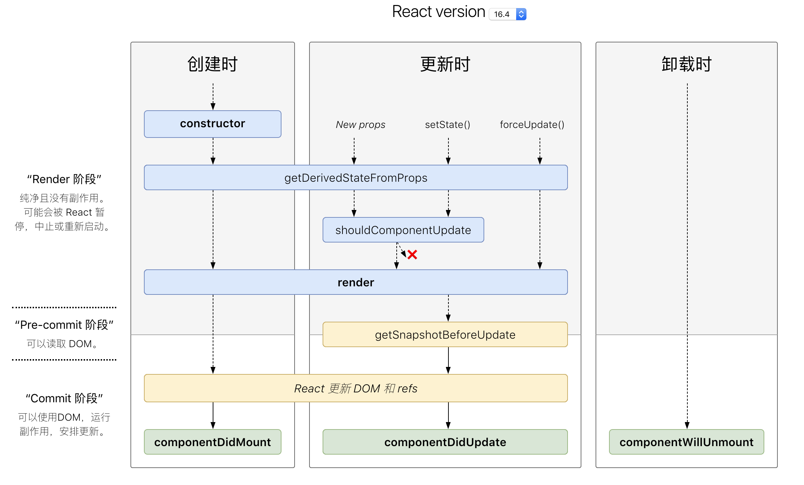

# React lifecycle - React 生命周期

React Component 的生命周期可以分为三个阶段：

- Mounting(挂载)
- Updating(更新)
- Unmounting(卸载)

## Mounting(挂载)

会在实例被创建和插入到DOM后调用下列方法：

- constructor()
- static getDerivedStateFromProps()
- render()
- componentDidMount()

## Updating(更新)

props 和 state 的变化都会导致组件更新，重新渲染时调用下列方法：

- static getDerivedStateFromProps()
- shouldComponentUpdate()
- render()
- getSnapshotBeforeUpdate()
- componentDidUpdate()

## Unmounting(卸载)

component 从DOM中移除时调用：

- componentWillUnmount()

## 方法详解

### constructor(props)

在React component mounted 之前被调用，不要在这里调用有副作用的或订阅的方法，这些放到`componentDidMount()`里去做。如果不用初始化 state 或者 不用 bind 方法，也可以不实现 constructor。

如果在这里为 state 传入 props 的值，当 props 更新时，state 并不会一同更新。如果需要将 state 与 props 的更新一致，可以在 `getDerivedStateFromProps()`中实现。

**不可以调用setState**

### static getDerivedStateFromProps(nextProps,prevState)

在 component 被实例化并接受新的 props 时调用。返回一个 object 来更新 state，或者返回 null 来表明新的 props 不需要更新 state。父组件的更新可能会导致这个 component 的渲染，即使没有修改 props 同样会导致该方法被调用。可能需要对比新旧值来判定是否需要更新。

调用`this.setState()`不会触发该方法。

### componentDidMount()

在 component 被实例化之后调用。可以在这个方法里请求远程数据，订阅方法，不要忘记在`componentWillUnmount()`取消订阅。

在方法里调用`setState()`会出发一次额外的渲染，但是发生在浏览器更新屏幕之前。所以即使在这里`render()`被调用两次，用户也不会感知这些。需要注意的是，这样做可能会导致一些性能问题。

**可以调用setState**

### shouldComponentUpdate(nextProps, nextState)

在渲染时接受新的 props 或者 state 时被调用。默认为 true，在初次渲染和`forceUpdate()`时不会被调用。当返回 false 时，component 不会阻止子组件的重新渲染。

当`shouldComponentUpdate()`返回 false 时，`render()`和`componentDidUpdate()`都不会被调用。

如果觉得 component 性能低，可以继承浅层次比对的`React.PureComponent`。如果非常确定，可以将`this.props`与`nextProps`或`this.state`与`nextState`比对来确定是否更新。

不要在该方法里，做深层次比对，或者使用`JSON.stringify()`。

### getSnapshotBeforeUpdate(prevProps, prevState)

在大量即时的渲染被提交到如DOM时被调用。使组件具有获取很多即时的值如滚动位置的能力。

### componentDidUpdate(prevProps, prevState, snapshot)

在 Updating 发生后被调用，不会在初次渲染被调用。

可以在组件被更新之前有机会操作DOM，也可以在这个方法里请求数据。

如果在组件中执行了`getSnapshotBeforeUpdate()`，将会在第三个参数传入返回值`snapshot`，否则将会传入`undefined`。

**可以调用setState**

### componentWillUnmount()

在组件卸载和销毁前调用。在该方法内可以做一些清除工作，比如取消定时器,取消网络请求,解绑订阅的事件。

**不可以调用setState**

### componentDidCatch(error, info)

## 参考

1. [React](https://reactjs.org/docs/react-component.html)
2. [react-lifecycle-methods-diagram](http://projects.wojtekmaj.pl/react-lifecycle-methods-diagram/)
3. [React 组件生命周期](https://github.com/superman66/Front-End-Blog/issues/2)