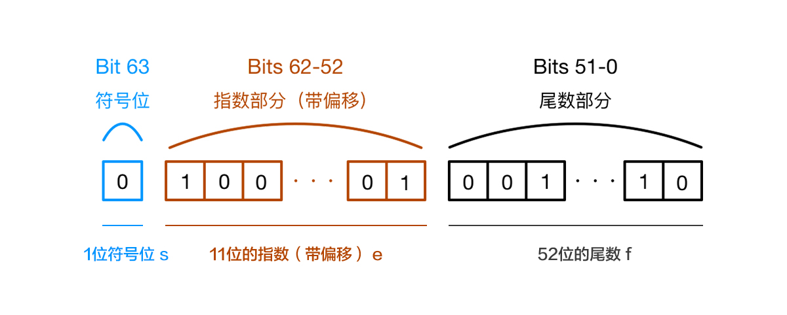

# 浮点数

JavaScript 里的数字是采用 IEEE 754 标准的 64 位双精度浮点数。该规范定义了浮点数的格式，对于64位的浮点数在内存中的表示，最高的1位是符号位，接着的11位是指数，剩下的52位为有效数字，具体：

第0位：符号位， s 表示 ，0表示正数，1表示负数；
第1位到第11位：储存指数部分， e 表示 ；
第12位到第63位：储存小数部分（即有效数字），f 表示，

十进制的小数都会被转换成二进制，但由于浮点数用二进制表达时是无穷的。IEEE 754 标准的 64 位双精度浮点数的小数部分最多支持 53 位二进制位，所以两者相加之后得到长度无限的二进制。因浮点数小数位的限制而截断的二进制数字，再转换为十进制时会产生误差。

## 解决方法

将数字转为整数，并记录小数位数。计算完成后将整数转为浮点数。